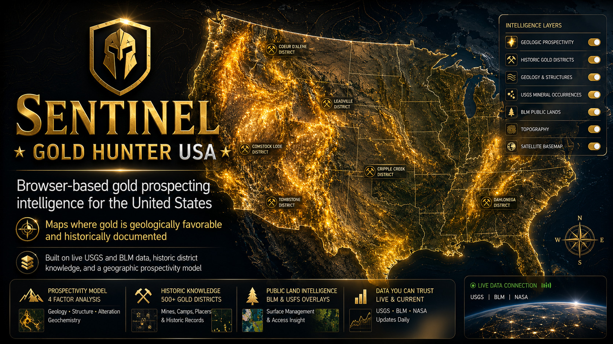

# Sentinel Gold Hunter Intel Dashboard

**[▶ Launch Live App](https://jkh2.github.io/sentinel-gold-hunter/gold_hunter_intel_dashboard_v4.html)**

A single-file, browser-based gold prospecting intelligence tool that maps **where gold is geologically favorable and historically documented** across the United States. Built on live USGS and BLM data, embedded historic district knowledge, and a geographic prospectivity model — not just a dot map.

---

## What It Is

Most gold hunting maps light up wherever someone filed a report. This one asks a harder question: *where should gold be, and how much evidence agrees?*

The prospectivity surface combines:

- **Live USGS MRDS records** — weighted by development status (Producer outweighs Past Producer outweighs Occurrence) and production size, so quality matters more than quantity
- **85 embedded historic gold districts** — Grass Valley, Carlin, Cripple Creek, Homestake, Nome, Dahlonega, and more
- **24 major US gold provinces** — regional geology that anchors the surface even before any records load
- **BLM active mining claims** — access conflict layer
- **USA Federal Lands** — surface manager classification (BLM/USFS open, NPS/DOD closed, non-federal flagged for verification)

The heat is rendered as a geographically-anchored canvas raster using a real Gaussian KDE in ground distance — not screen pixels. It lands where it scores, stays put when you zoom, and updates whenever you move the map.

---

## What It Does

- Renders a **prospectivity surface** (color ramp from low to high) anchored to lat/lng coordinates across any viewport in the US
- **Ranks the top 10 target cells** in the current view with non-maximum suppression, so you get separated candidates rather than a cluster
- Shows **confidence level** per target — low when the score is geology-only inference, higher when documented producers are nearby
- Shows **access risk** per target — cross-referenced against federal land manager and nearby active claims
- **Point inspector** — click anywhere to get a full audit: nearby MRDS records, producers, historic districts, claims, land status, and field notes
- Deposit focus mode: tune the model toward **placer** (stream/alluvial) or **lode** (hardrock/vein) targets
- Adjustable influence radius, geology weight, and opacity sliders
- Jump menu to major US gold provinces: Colorado Mineral Belt, Carlin Trend, Mother Lode, Goldfield, Black Hills, Fairbanks, Nome, Bradshaw, Dahlonega, SW Montana

---

## How to Use It

**No installation. No backend. No API key.**

1. Download `gold_hunter_intel_dashboard_v4.html`
2. Open it in any modern browser
3. Pick a district from the jump menu and press **Go**
4. Press **Scan area** to pull live USGS/BLM records for the current view
5. Read the ranked targets and click the map to inspect any point

The prospectivity surface renders immediately from embedded geology and historic districts — even before a scan. Live data adds MRDS records and claim/land overlays on top.

### Controls

| Control | What it does |
|---|---|
| Jump menu | Fly to a major US gold province |
| Scan area | Pull live MRDS, claims, and land status for the current view |
| Deposit focus | Bias the model toward placer or lode targets |
| Influence radius | Geographic spread of each record's weight (km) |
| Geology weight | How much the embedded province model contributes vs live records |
| Surface opacity | Transparency of the prospectivity raster |
| Auto re-scan | Automatically reload records when you stop moving (zoom 7+) |
| Point inspector | Click any map location for a full evidence audit |

### Layers (upper-right layer control)

- **MRDS gold records** — individual USGS site markers (bright = documented producer)
- **Historic districts** — embedded knowledge layer, always on
- **Geology favorability** — province outlines
- **BLM land status** — green = open, orange = restricted, red = closed
- **Active claims** — BLM MLRS not-closed claims (orange outlines)
- **Ranked targets** — numbered target circles with access color coding

---

## Data Sources

| Source | Provider | Notes |
|---|---|---|
| Mineral Resources Data System (MRDS) | USGS | Live ArcGIS FeatureServer. Updated through ~2011. |
| Not-Closed Mining Claims (MLRS) | BLM | Live. Indicates active claim holders, not ownership. |
| USA Federal Lands | Esri / ArcGIS Living Atlas | Federal surface managers. Non-federal = private/state — verify separately. |
| Historic districts | Embedded | ~85 districts compiled from published literature. |
| Gold provinces | Embedded | 24 major US gold-bearing provinces, coarse heuristic. |

---

## Honesty Notes

This tool produces a **relative prospectivity model**, not assay data or gold concentration.

- MRDS records reflect historical reporting, not systematic coverage. Absence of a record is not absence of gold.
- The geology layer is a coarse heuristic — favorable does not mean mineable.
- Land status is the **first gate**, not permission. Always independently verify active claims on [BLM MLRS](https://mlrs.blm.gov), surface and mineral ownership, access road legality, waterway dredging rules, and seasonal closures before any field work.
- This is a browser prototype. Public ArcGIS services may throttle, change schemas, or temporarily go offline.

---

## Technical Notes

- Single HTML file — no build step, no dependencies to install
- Leaflet 1.9.4 for the map base
- Geographic KDE via separable Gaussian blur on a lat/lng grid (not screen-pixel radius)
- Canvas raster rendered as `L.imageOverlay` bound to exact coordinate bounds — zoom-stable and pan-stable
- Evidence accumulation uses max + capped corroboration bonus (quality dominates quantity)
- All live data fetched directly from public ArcGIS REST endpoints with CORS

---

## License

MIT License — see [LICENSE](LICENSE)

Copyright (c) 2026 James Keith Harwood II

---

## Contact

[jameskeithharwood.com](https://www.jameskeithharwood.com)

GitHub: [@jkh2](https://github.com/jkh2)

Repository: [github.com/jkh2/sentinel-gold-hunter](https://github.com/jkh2/sentinel-gold-hunter)
