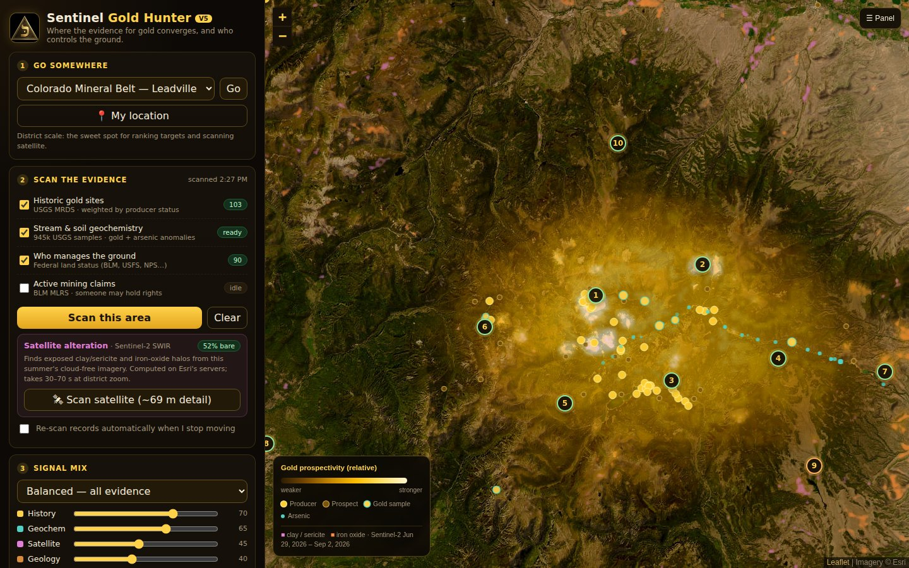

# Sentinel Gold Hunter



**[▶ Launch Live App](https://jkh2.github.io/sentinel-gold-hunter/index.html)**

A browser-based gold prospecting tool that maps **where independent evidence for gold converges** across the United States, and **who controls the ground**. It blends historic mine records, 945,000 USGS geochemistry samples, Sentinel-2 satellite alteration, and regional geology into one scored surface, then ranks targets you can take into the field.

No satellite can see gold underground. What it *can* see are the altered rocks hydrothermal systems leave behind. Old stream samples *can* show gold and arsenic washing out of a drainage. Old records *can* show where miners already found it. Gold Hunter asks where those signals agree.

---

## What's new in V5

- **Four evidence channels** instead of two: History, Geochemistry, Satellite, and Geology, each with its own weight slider and its own color on every target card
- **Stream, soil, and pan-concentrate geochemistry** from the USGS National Geochemical Survey, NURE-HSSR, and the National Geochemical Database, preprocessed into `data/geochem.json`
- **Satellite alteration scan** that computes Sentinel-2 SWIR clay/sericite and iron-oxide ratios on Esri's servers from this summer's cloud-free imagery
- **Discovery mode**, which down-weights known mines to surface ground with geochem or satellite evidence but no recorded workings
- **USGS context overlays**: bedrock geology, faults, magnetic anomaly, old mine and prospect symbols from topo maps, the ASTER mineral map, and Landsat 8 iron minerals
- **GPX export** of ranked targets for a handheld GPS or phone
- **MRDS source fixed.** The ArcGIS copy V4 used now requires a token, so V5 reads MRDS straight from USGS
- **Edge fix.** Evidence just off-screen used to pile onto the map border; the grid now extends past the view

---

## How the score works

Each channel is built on the same ground-distance grid and normalized 0–1.

| Channel | Evidence | Notes |
|---|---|---|
| **History** | USGS MRDS gold sites + 85 embedded historic districts | Producers outweigh prospects and occurrences; quality beats quantity |
| **Geochem** | Gold and arsenic in stream sediment, soil, and pan concentrates | A sample scores only if it is in the top ~12% for gold (or ~10% for arsenic, a gold pathfinder) among samples run by the **same method**, because detection limits differ about 1000× across 60 years of sampling |
| **Satellite** | Sentinel-2 B11/B12 (clay, sericite, Al-OH) and red/blue (ferric iron oxide) | Bare ground only (NDVI mask). A pixel must be unusual for the whole scene **and** for its ~4 km neighborhood, and part of a contiguous patch |
| **Geology** | 24 major U.S. gold provinces | Coarse prior |

The surface is the **weighted average of the channels that have data at each spot**. A place with no geochem samples is treated as *unknown* for that channel, not as zero. Where two or more independent channels agree, the score gets a convergence bonus. Confidence rises with documented producers, channel agreement, and sampling density. The point inspector also calls out real negative evidence, such as samples that were tested and came back quiet.

### Validation

Checked in a headless browser against known districts:

- **Summitville, CO**: after a satellite scan, target #1 lands about 600 m from the Summitville mine, and Platoro ranks #3
- **Cripple Creek, CO**: the Cresson pit scores about 10× the scene average in the satellite channel
- **Geochem**: Leadville, Cripple Creek, Carlin, and Summitville light up, while Kansas and Iowa stay dark
- **San Luis Valley floor**: broad bare farmland no longer false-flags as iron oxide

---

## How to use it

**No installation, no backend, no API key.** Use the live app, or clone the repo and serve the folder. The app loads `data/geochem.json`, so open it through a web server rather than double-clicking the file:

```
python3 -m http.server 8000
# then open http://localhost:8000
```

1. Pick a district from **Go somewhere**
2. Press **Scan this area** to pull live USGS/BLM records for the view
3. At district zoom, press **🛰 Scan satellite** (about 15–70 seconds)
4. Read the ranked targets. The colored bar shows which evidence drives each one
5. Tap anywhere to inspect a point, then press **⬇ GPX** to take targets into the field

### Signal mix presets

| Preset | Use it to |
|---|---|
| Balanced | Weigh all evidence |
| Discovery | Find ground with geochem or satellite evidence but no recorded mines |
| History | Follow where the old-timers already proved gold |

---

## Data sources

| Source | Provider | How it's used |
|---|---|---|
| [Mineral Resources Data System](https://mrdata.usgs.gov/mrds/) | USGS | Live WFS, updated through ~2011 |
| [National Geochemical Survey](https://mrdata.usgs.gov/geochem/) | USGS | Preprocessed into `data/geochem.json` |
| [NURE-HSSR sediments](https://mrdata.usgs.gov/nure/sediment/) | DOE / USGS | Preprocessed |
| [NGDB concentrates and sediments](https://mrdata.usgs.gov/ngdb/) | USGS | Preprocessed |
| [Sentinel-2 imagery service](https://sentinel.arcgis.com/arcgis/rest/services/Sentinel2/ImageServer) | ESA / Esri | Live band math on the last 14 months of imagery |
| Not-closed mining claims (MLRS) | BLM | Live |
| USA Federal Lands | Esri Living Atlas | Live |
| Geology, faults, magnetics, mine symbols, ASTER and Landsat mineral maps | [USGS mrdata tiles](https://mrdata.usgs.gov/) | View-only context overlays |

To rebuild the geochem file from the USGS bulk downloads, see `tools/build_geochem.py`.

---

## Honesty notes

This is a **relative prospectivity model**, not assay data or a promise of gold.

- MRDS stopped systematic updates in 2011, and most geochem sampling is decades old. Absence of a record is not absence of gold.
- Satellite alteration also lights up mine dumps, roads, and some bare soils. It sees the surface only, and forest hides it.
- The geology layer is a coarse heuristic. Favorable does not mean mineable.
- Land status is the **first gate, not permission**. Always verify active claims on [BLM MLRS](https://mlrs.blm.gov), surface and mineral ownership, road access, waterway and dredging rules, and seasonal closures before any field work.
- Public map services can throttle, change, or go offline.

---

## Technical notes

- One HTML page plus `data/geochem.json` (~4 MB, ~0.85 MB gzipped) and small assets. No build step
- Leaflet 1.9.4
- Geographic KDE via separable Gaussian blur on a lat/lng grid padded 25% past the view
- Satellite requests are split into ≤512 px tiles, fetched four at a time with retries, and stitched, so no single request hits the server's gateway timeout
- Satellite anomaly: histogram ranks for the scene, an integral-image local background for the neighborhood, and a box-filter coherence pass

---

## License

MIT License. See [LICENSE](LICENSE).

Copyright (c) 2026 James Keith Harwood II

## Contact

[jameskeithharwood.com](https://www.jameskeithharwood.com) · GitHub [@jkh2](https://github.com/jkh2) · [github.com/jkh2/sentinel-gold-hunter](https://github.com/jkh2/sentinel-gold-hunter)
